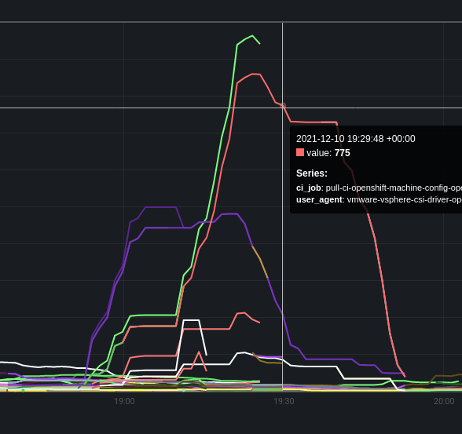

# vSphere + OpenShift CI Server Metrics

This application exports Prometheus metrics that bring together vSphere Sessions and related OpenShift CI jobs. This can
be used for troubleshooting session leaks or session limit issues.

Once application is running, metrics are exposed at `localhost:8090/metrics`. Of course, port is configurable.

These metrics can be scraped by Prometheus to view. In this screenshot, we can see a specific CI job and User Agent
using a notable number of sessions.



# TODO

- Error handle loss of vSphere session 
- Error handle loss of k8s/ocp auth
  - Use service account

# Usage

```shell
Usage:
  vsphere-ci-session-metrics start [flags]

Flags:
  -h, --help                        help for start
      --kubeconfig string           path to build cluster kubeconfig
      --listen-port int             exporter will listen on this port (default 8090)
      --log-level string            set log level (e.g. debug, warn, error) (default "info")
      --prow string                 URL for Prow CI instance (default "prow.ci.openshift.org")
      --vsphere string              vSphere hostname (do not include scheme)
      --vsphere-passwd string       password for vSphere
      --vsphere-user string         username for vSphere
      --vsphere-user-agent string   user agent to vSphere communication (default "vsphere-ci-session-metrics")
```

The following flags are **REQUIRED**:

- `--kubeconfig`
- `--vsphere`
- `--vsphere-passwd`
- `--vsphere-user`

The rest are entirely optional and have default values.

## Environment Variables

If you'd rather use environment variables instead of CLI flags:

- `KUBECONFIG`
- `LISTEN_PORT`
- `LOG_LEVEL`
- `PROW`
- `VSPHERE_PASSWD`
- `VSPHERE_USER`
- `VSPHERE_USER_AGENT`

# Run Locally

Here's an example command:

```shell
./vsphere-ci-session-metrics \
   --kubeconfig mykc \
   --vsphere vc.example.com \
   --vsphere-user administrator@vsphere.local \
   --vsphere-passwd tops3cret

INFO[0000] Launching on :8090...                        
```

# Run in k8s

TODO

## Caveats

If there are 2 or more CI jobs running at the same time with the _same_ CI user, the metric 
will essentially be duplicated, one for each job. This means if you were to run a query like this:

`sum by(username) (vsphere_ci_user_sessions_correlated)`

it would return an exaggerated session count. It is advised to _not_ use the query above without 
having a second `by(...)` field. For example:

`sum by(username,ci_job) (vsphere_ci_user_sessions_correlated)` 

would be fine. 

It is important to keep in mind it's not currently possible to differeniate between 2 or more CI jobs
in terms of their session usage in the event those CI jobs run at the same time. 
